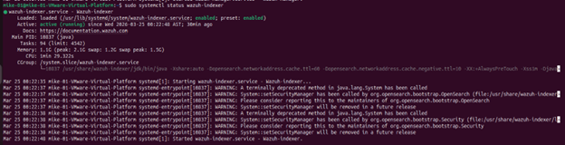
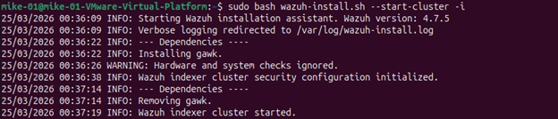
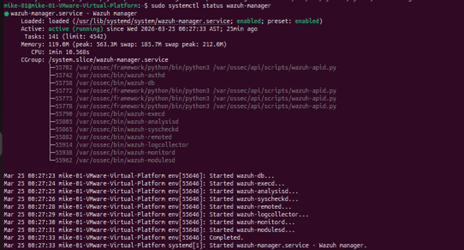
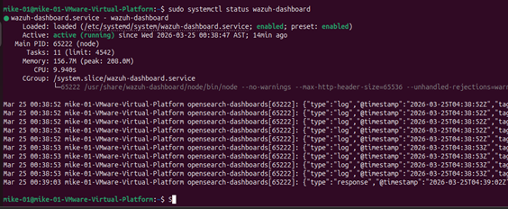
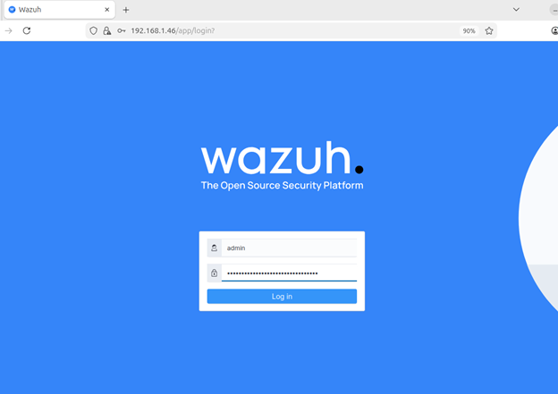
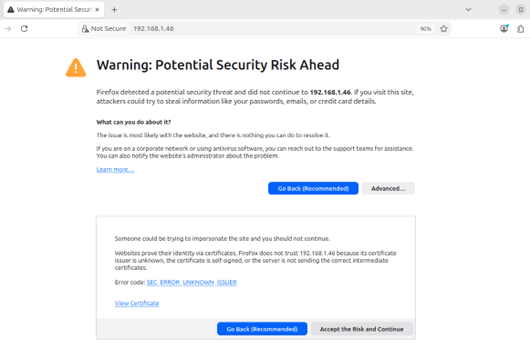
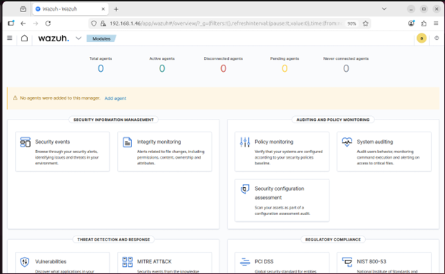
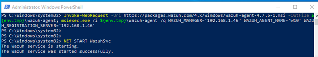
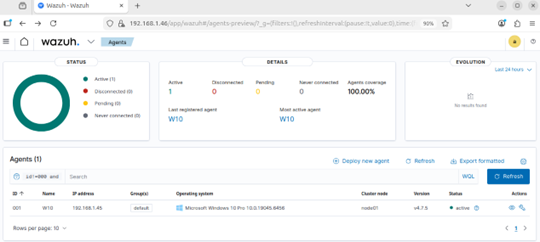
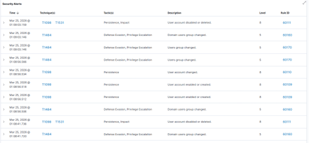

# 🛡️ Laboratorio 03 — Monitoreo con SIEM: Wazuh


## 🎯 Objetivo

Instalar y configurar Wazuh como plataforma SIEM para monitorear eventos de seguridad
en tiempo real, conectar un agente en Windows 10 y analizar alertas correlacionadas
con el framework MITRE ATT&CK. Se simulan actividades maliciosas reales (creación
y eliminación de usuarios) para verificar la capacidad de detección del SIEM.

---

## 🖥️ Entorno

| Rol | Sistema | IP | Versión |
|-----|---------|----|---------|
| Wazuh Server | Ubuntu | 192.168.1.46 | 22.04 LTS |
| Wazuh Agent | Windows 10 Pro | 192.168.1.45 | 10.0.19045 |
| Wazuh | — | — | 4.7.5 |

---

## 🛠️ Herramientas utilizadas

- **Wazuh Manager** — Motor de correlación de eventos y alertas
- **Wazuh Indexer** (OpenSearch) — Almacenamiento y búsqueda de logs
- **Wazuh Dashboard** — Interfaz web de visualización y análisis
- **Filebeat** — Transporte de logs entre componentes
- **MITRE ATT&CK Framework** — Correlación de técnicas de ataque

---

## 📋 Procedimiento

### Paso 1 — Preparación del servidor Ubuntu

Se descargó el instalador oficial y el archivo de configuración de Wazuh:
```bash
curl -sO https://packages.wazuh.com/4.7/wazuh-install.sh
curl -sO https://packages.wazuh.com/4.7/config.yml
```

Se editó `config.yml` colocando la IP del servidor `192.168.1.46` en los nodos
de indexer, server y dashboard.

### Paso 2 — Instalación de componentes

Se instalaron los componentes en orden usando el flag `-i` para omitir
la verificación de sistema operativo:

```bash
sudo bash wazuh-install.sh --generate-config-files -i
sudo bash wazuh-install.sh --wazuh-indexer node-1 -i
sudo bash wazuh-install.sh --wazuh-server wazuh-1 -i
sudo bash wazuh-install.sh --start-cluster -i
sudo bash wazuh-install.sh --wazuh-dashboard dashboard -i
```

> **Nota:** El dashboard debe instalarse **después** de iniciar el cluster.
> Ver sección de errores para el detalle completo.

### Paso 3 — Verificación de servicios

```bash
sudo systemctl status wazuh-manager
sudo systemctl status wazuh-indexer
sudo systemctl status wazuh-dashboard
```

Los tres servicios mostraron estado `active (running)` ✅

### Paso 4 — Acceso al Dashboard

Se accedió a `https://192.168.1.46` desde el navegador.
El navegador mostró advertencia SSL por certificado self-signed — normal en laboratorio.
Se aceptó el riesgo y se inició sesión con el usuario `admin`.

### Paso 5 — Instalación del agente en Windows 10

Desde el dashboard se generó el comando de instalación. Se ejecutó en
PowerShell como Administrador en la VM Windows 10:

```powershell
Invoke-WebRequest -Uri https://packages.wazuh.com/4.x/windows/wazuh-agent-4.7.5-1.msi `
  -OutFile $env:tmp\wazuh-agent.msi

msiexec.exe /i $env:tmp\wazuh-agent.msi /q `
  WAZUH_MANAGER='192.168.1.46' WAZUH_AGENT_NAME='W10'

NET START WazuhSvc
```

Resultado: `The Wazuh service was started successfully` ✅

### Paso 6 — Simulación de actividad maliciosa

Desde CMD como Administrador en Windows 10 se creó y eliminó un usuario
para simular actividad sospechosa de un atacante:

```cmd
net user usuarioprueba Password123 /add
net user usuarioprueba /delete
```

Wazuh detectó y correlacionó automáticamente los eventos con MITRE ATT&CK.

---

## ⚠️ Errores encontrados y soluciones

### Error 1 — Sistema operativo no compatible

Durante la instalación, Wazuh detectó que el SO no estaba en su lista oficial:
```
ERROR: The recommended systems are: Red Hat Enterprise Linux 7, 8, 9;
CentOS 7, 8; Amazon Linux 2; Ubuntu 16.04, 18.04, 20.04, 22.04.
```

**Solución:** Se agregó el flag `-i` a todos los comandos de instalación
para omitir la verificación del sistema operativo.

---

### Error 2 — Dashboard no pudo conectarse al Indexer

Al intentar instalar el dashboard antes de iniciar el cluster:
```
ERROR: Cannot connect to Wazuh dashboard.
ERROR: Wazuh indexer security settings not initialized.
Please run the installation assistant using -s|--start-cluster
in one of the wazuh indexer nodes.
INFO: --- Removing existing Wazuh installation ---
INFO: Wazuh dashboard removed.
```

**Causa:** El cluster del Indexer debe iniciarse antes de instalar el dashboard.

**Solución:** Se ejecutó primero la inicialización del cluster:
```bash
sudo bash wazuh-install.sh --start-cluster -i
```

Resultado:
```
INFO: Wazuh indexer cluster security configuration initialized.
INFO: Wazuh indexer cluster started.
```

Luego se reinstalo el dashboard exitosamente.

---

## 📸 Capturas de Pantalla

### 1️⃣ Error durante la instalación


### 2️⃣ Solución — Inicialización del cluster


### 3️⃣ Wazuh Manager — estado active (running)


### 4️⃣ Wazuh Indexer — estado active (running)


### 5️⃣ Wazuh Dashboard — estado active (running)


### 6️⃣ Login de Wazuh


### 7️⃣ Advertencia SSL del navegador


### 8️⃣ Dashboard principal con todos los módulos


### 9️⃣ Instalación del agente en Windows 10


### 🔟 Agente W10 activo en el dashboard


### 1️⃣1️⃣ Alertas de seguridad con MITRE ATT&CK


---

## 🔍 Findings (Hallazgos)

- Wazuh detectó en tiempo real la **creación y eliminación del usuario** `usuarioprueba` desde Windows 10
- Las alertas fueron correlacionadas automáticamente con **5 técnicas MITRE ATT&CK** distintas
- Se identificó el agente `W10` como origen de todos los eventos — trazabilidad completa
- El dashboard mostró nivel de alerta **8 (High)** para las operaciones de usuario — umbral correcto para actividad administrativa sospechosa
- Wazuh detectó cambios en grupos de dominio (`Domain users group changed`) con nivel 5, lo que indica visibilidad sobre cambios de permisos

**Técnicas MITRE ATT&CK detectadas:**

| Técnica | Táctica | Descripción | Nivel |
|---------|---------|-------------|-------|
| T1098, T1531 | Persistence, Impact | User account disabled or deleted | 🔴 8 |
| T1098 | Persistence | User account enabled or created | 🔴 8 |
| T1098 | Persistence | User account changed | 🔴 8 |
| T1484 | Defense Evasion, Privilege Escalation | Domain users group changed | 🟡 5 |
| T1484 | Defense Evasion, Privilege Escalation | Users group changed | 🟡 5 |

---

## ⚠️ Impacto

- La **creación de usuarios no autorizados** (T1098) es una técnica de persistencia — un atacante que logra crear una cuenta puede mantener acceso incluso si su vector inicial es cerrado
- La **eliminación de usuarios** (T1531) puede ser usada para impactar operaciones o destruir evidencia forense de cuentas comprometidas
- Los **cambios en grupos de dominio** (T1484) permiten escalada de privilegios — agregar un usuario a administradores sin detección es uno de los movimientos laterales más comunes
- Sin un SIEM como Wazuh, estas actividades pasarían desapercibidas en los logs de Windows a menos que alguien los revisara manualmente
- El nivel de alerta 8 indica que Wazuh prioriza correctamente estos eventos — un analista SOC los vería inmediatamente en el dashboard

---

## 🚨 Detección (SOC)

- **Alerta Wazuh nivel 8:** `net user /add` ejecutado — creación de cuenta local sospechosa
- **Alerta Wazuh nivel 8:** `net user /delete` ejecutado — eliminación de cuenta post-actividad
- **Alerta Wazuh nivel 5:** Modificación de grupos de usuarios — posible escalada de privilegios
- **Event ID Windows 4720:** User account created — capturado por el agente Wazuh
- **Event ID Windows 4726:** User account deleted — capturado por el agente Wazuh
- **Event ID Windows 4732:** Member added to security-enabled local group
- **Correlación MITRE:** T1098 (Account Manipulation) mapeado automáticamente por Wazuh

---

## 🛡️ Mitigación

**Restricción de creación de usuarios:**
```
Group Policy → Computer Configuration → Windows Settings →
Security Settings → Local Policies → User Rights Assignment →
"Add users to local groups" → Solo Administradores autorizados
```

**Alertas en tiempo real:**
- Configurar notificaciones de Wazuh por email o Slack para alertas nivel ≥ 7
- Implementar reglas personalizadas para detección de `net user` en CMD/PowerShell

**Auditoría de cuentas:**
```
Group Policy → Advanced Audit Policy Configuration →
Account Management → Audit User Account Management → Success and Failure
```

**Principio de mínimo privilegio:**
- Revisar y eliminar cuentas de administrador local innecesarias
- Implementar JIT (Just-In-Time) access para cuentas privilegiadas
- Deshabilitar la cuenta Administrator local por defecto:
```powershell
Disable-LocalUser -Name "Administrator"
```

**Respuesta a incidentes:**
- Ante alerta T1098 nivel 8: verificar identidad del usuario que ejecutó el comando
- Revisar Event ID 4624 (logon) previo a la creación — identificar la sesión origen
- Correlacionar con otros eventos del mismo host en la ventana de tiempo ±15 minutos

---

## ✅ Conclusiones

1. Se instaló exitosamente Wazuh 4.7.5 como plataforma SIEM completa en Ubuntu,
   incluyendo Manager, Indexer y Dashboard, resolviendo errores reales de instalación
2. Se conectó un agente en Windows 10 Pro logrando cobertura completa del host objetivo
3. Wazuh detectó automáticamente eventos de creación y eliminación de usuarios,
   correlacionándolos con 5 técnicas del framework MITRE ATT&CK en tiempo real
4. El nivel de alerta 8 asignado a las operaciones de usuario confirma que Wazuh
   prioriza correctamente eventos de alto riesgo para un analista SOC
5. La visibilidad sobre cambios en grupos de dominio (T1484) demuestra que Wazuh
   va más allá de los eventos básicos — cubre tácticas de escalada de privilegios
6. Un SIEM como Wazuh es fundamental en cualquier SOC — sin él, actividades de
   persistencia como la creación de usuarios pasarían desapercibidas en logs dispersos

---

## 🔗 Referencias

- [Documentación oficial de Wazuh](https://documentation.wazuh.com)
- [MITRE ATT&CK — T1098 Account Manipulation](https://attack.mitre.org/techniques/T1098/)
- [MITRE ATT&CK — T1531 Account Access Removal](https://attack.mitre.org/techniques/T1531/)
- [MITRE ATT&CK — T1484 Domain Policy Modification](https://attack.mitre.org/techniques/T1484/)
- [Wazuh Rules Reference](https://documentation.wazuh.com/current/user-manual/ruleset/index.html)
- [Windows Security Event IDs Reference](https://learn.microsoft.com/en-us/windows/security/threat-protection/auditing/advanced-security-audit-policy-settings)

---

*← [Volver al Portafolio Principal](../README.md)*
